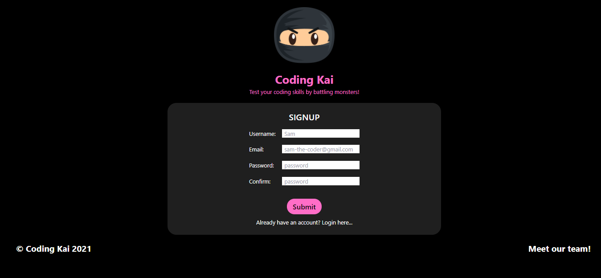
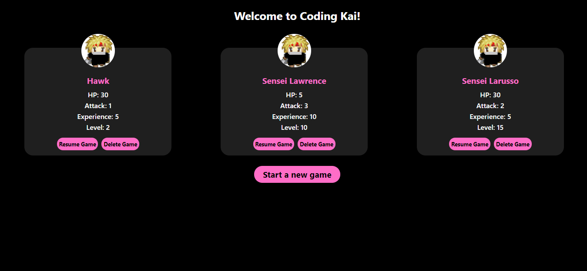
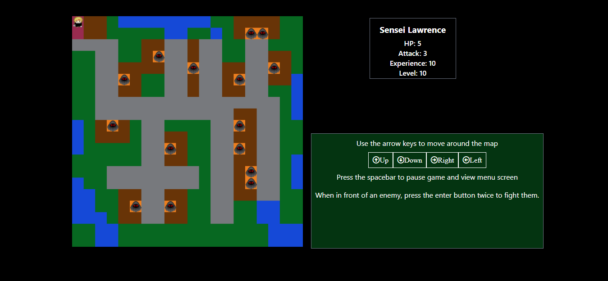
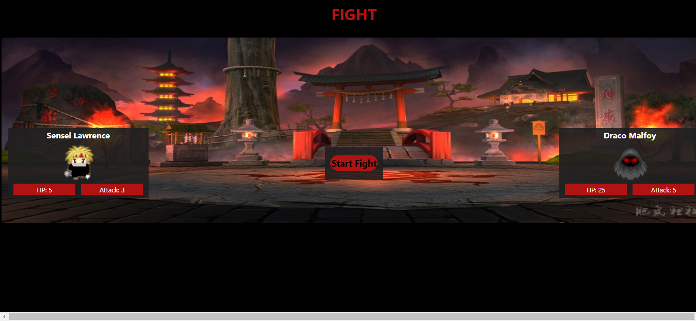
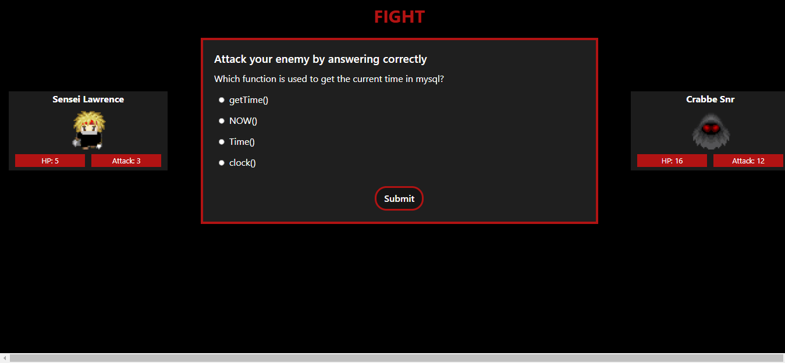
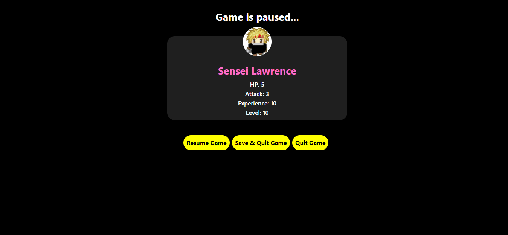
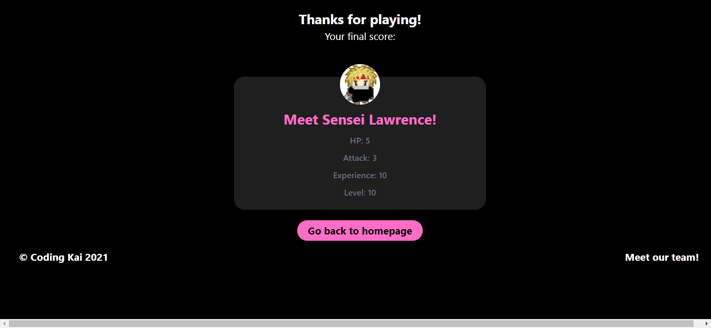
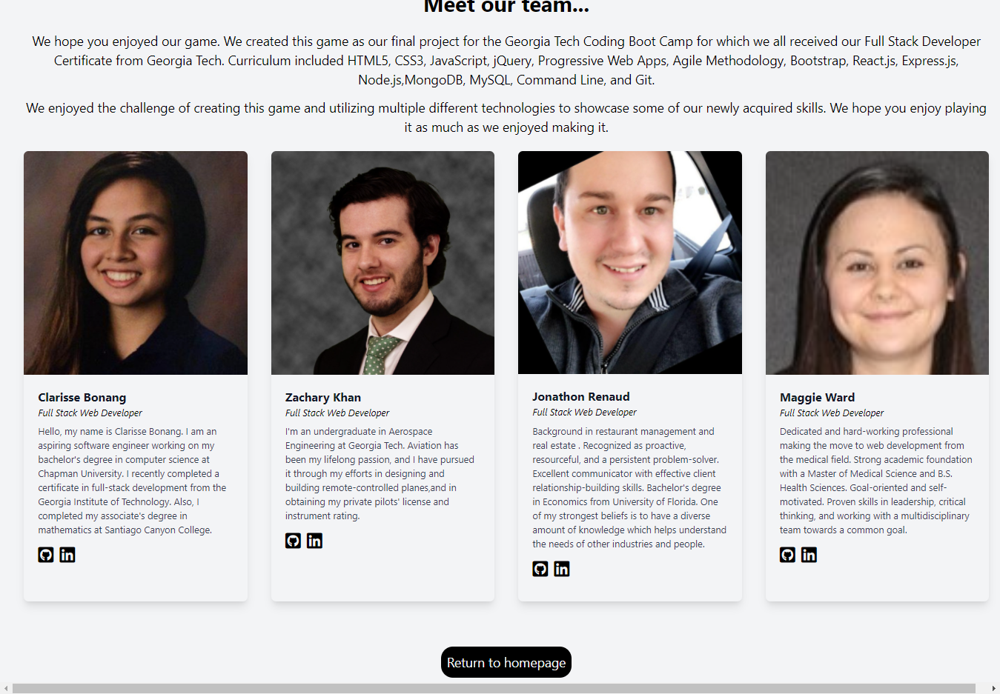

# Coding Kai

## Description

Do you like fun online games? Do you like martial arts? Do you want to improve your coding skills? Then check out Coding Kai! Coding Kai is a 2D RPG allowing characters to interact with enemies in each level and overcome them by answering coding questions to make progress in the game.

## User Story

- AS A gamer interested in coding
- I WANT TO have a fun way to practice coding questions
- SO THAT I can improve my coding abilities

## Acceptance criteria:

- GIVEN an online RPG game
- WHEN I launch the application
- THEN I am greeted with a login page
- WHEN I sign in to the application
- THEN I am brought to the homescreen can choose to begin when I left off or restart
- WHEN I choose to delete character
- THEN my character data is deleted
- WHEN I choose to start the game where I left off
- THEN I reload onto the map where I left off
- WHEN I am beginning a new game
- THEN I am greeted with an initial story
- WHEN I input preset commands on the keyboard (such as arrow keys or wasd to move or a pause keystroke with spacebar)
- THEN I am able to move my character sprite around or access the menu
- WHEN I am on the menu screen
- THEN I am shown options to unpause or to exit game
- WHEN I exit game
- THEN my stats are stored for later and the application ends
- WHEN I unpause the game
- THEN the menu screen goes away and I am back on the map in the same position
- WHEN I ‘touch’ an enemy sprite
- THEN I can use ‘enter’ twice to attack the enemy
- WHEN I attack the enemy
- THEN a coding question appears
- WHEN I answer a coding question correctly
- THEN I decrease the enemy’s Health Points by my attack
- WHEN I answer the question incorrectly
- THEN I have my Health Point (HP) decreased by the enemies attack
- WHEN I have my HP decreased to zero
- THEN I am defeated and and must create a new character
- WHEN I ‘defeat’ an enemy
- THEN the character is granted ‘experience’ towards leveling up
- The following will be implemented later...
- WHEN I ‘level up’
- THEN I am granted an increase to combat stats
- WHEN I reach a certain character level
- THEN I can move onto the next map
- WHEN I move onto the next map
- THEN I am greeted with the next portion of the story

## Table of Contents

- [Installation](#installation)
- [Usage](#usage)
- [Credits](#credits)
- [Contribution Guidelines](#contribution-guidelines)
- [Test Instructions](#test-instructions)
- [License](#license)

## Installation

Go to deployed URL below

## Usage

On page load, you can login or signup to create a new account. Once logged in, you can start the game. Choose to play with a new or existing character. This will take you to the story page and then to the map. Move around the map using the arrow keys (up, down, left, right). When you encounter an enemy you would like to fight, tap enter twice to enter the fight page. Click start fight and you will be presented with a coding question to answer. Get it right and you win points. Get it wrong and your enemy wins and you lose points. To pause the game, press the space bar which opens the pause/menu screen. From there, you can return to the game you were playing or quit. You can choose to save your game to pick up where you left off at a later point or delete your game.

## Credits

Libraries and Sources:

- Node.js and Express.js: RESTful API
- Express-session and connect-session-sequelize: authentication ----------jsonwebtoken
- Mongoose: Object Data Modeling (ODM) library for MongoDB and Node.js
- Heroku: deploy application
- React, react-dom, react-router-dom: user interface
- Axios: API requests
- Bcrypt: hash password
- Path: working with file and directory paths
- Wireframe cc: create wireframes
- Tailwinds: CSS
- Canvas API: used to render tilemap
- Eslint, prettier: formatting
- QuizAPI: coding questions
- OpenGameArt: sprites
- Font Awesome: icons

Collaborative project between <a href="https://github.com/bonang8">Clarisse Bonang</a>, <a href="https://github.com/roomsiejones">Jonathon Renaud</a>, <a href="https://github.com/mlward639">Maggie Ward</a>, and <a href="https://github.com/zack-khan">Zachary Khan</a>.

## Contribution Guidelines

Utilize <a href= "https://www.contributor-covenant.org/version/2/0/code_of_conduct/code_of_conduct.md">The Contributor Covenant</a> as reference for appropriate contribution guidelines.

## Test Instructions

n/a

## License

License type: MIT

    "Copyright 2021 <COPYRIGHT HOLDER>

    Permission is hereby granted, free of charge, to any person obtaining a copy of this software and associated documentation files (the "Software"), to deal in the Software without restriction, including without limitation the rights to use, copy, modify, merge, publish, distribute, sublicense, and/or sell copies of the Software, and to permit persons to whom the Software is furnished to do so, subject to the following conditions:

    The above copyright notice and this permission notice shall be included in all copies or substantial portions of the Software.

    THE SOFTWARE IS PROVIDED "AS IS", WITHOUT WARRANTY OF ANY KIND, EXPRESS OR IMPLIED, INCLUDING BUT NOT LIMITED TO THE WARRANTIES OF MERCHANTABILITY, FITNESS FOR A PARTICULAR PURPOSE AND NONINFRINGEMENT. IN NO EVENT SHALL THE AUTHORS OR COPYRIGHT HOLDERS BE LIABLE FOR ANY CLAIM, DAMAGES OR OTHER LIABILITY, WHETHER IN AN ACTION OF CONTRACT, TORT OR OTHERWISE, ARISING FROM, OUT OF OR IN CONNECTION WITH THE SOFTWARE OR THE USE OR OTHER DEALINGS IN THE SOFTWARE."

Source for licensing information: <a href="https://opensource.org/licenses/MIT">Link to MIT license information</a>

## Screenshots

Screenshot of Sign Up Page:

Screenshot of Homepage:

Screenshot of Game Page:

Screenshot of Fight Page:

Screenshot of Question Page:

Screenshot of Pause Page:

Screenshot of Quit Page:

Screenshot of Meet Page:

## URLs

<a href="https://github.com/mlward639/Coding-Kai">Link to GitHub Repository</a>

<a href="https://shrouded-temple-97141.herokuapp.com/">Link to Deployed Application</a>

<a href="https://docs.google.com/presentation/d/1ltJcClFWCoBUaLo8J0AFW42987DlkbmdFESNDMg58TQ/edit?usp=sharing">Link to Presentation</a>
